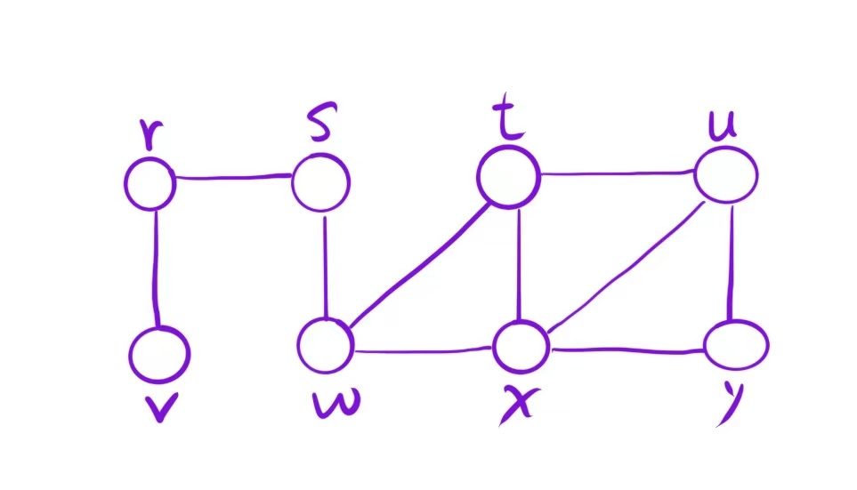
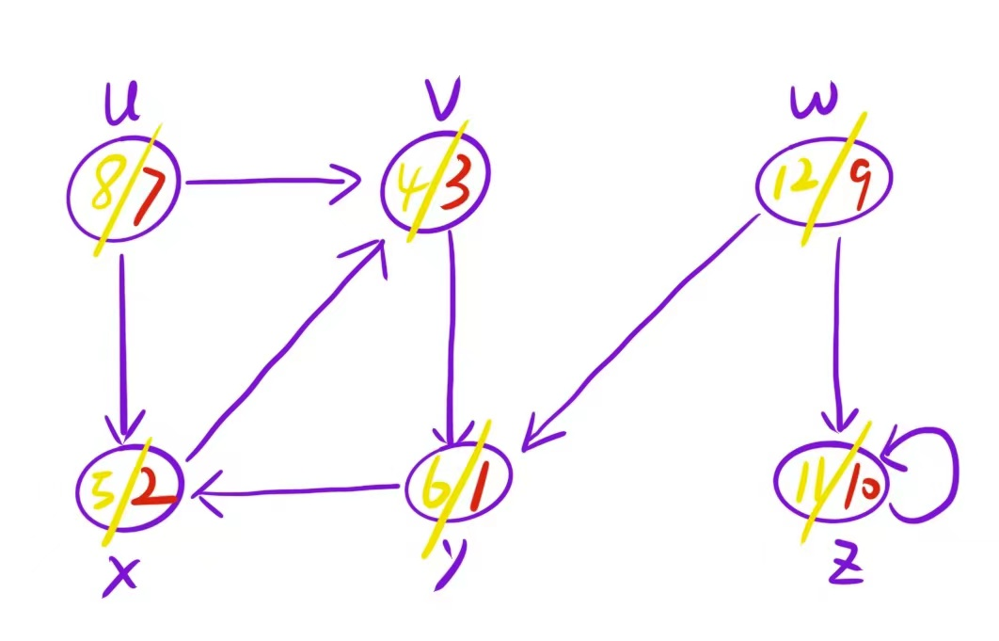
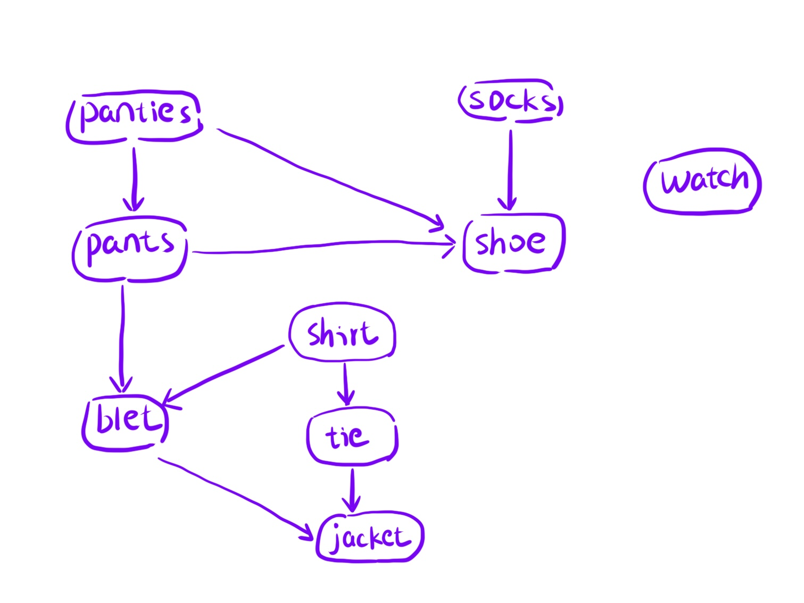
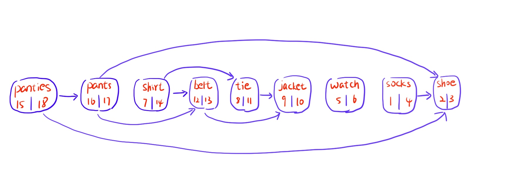
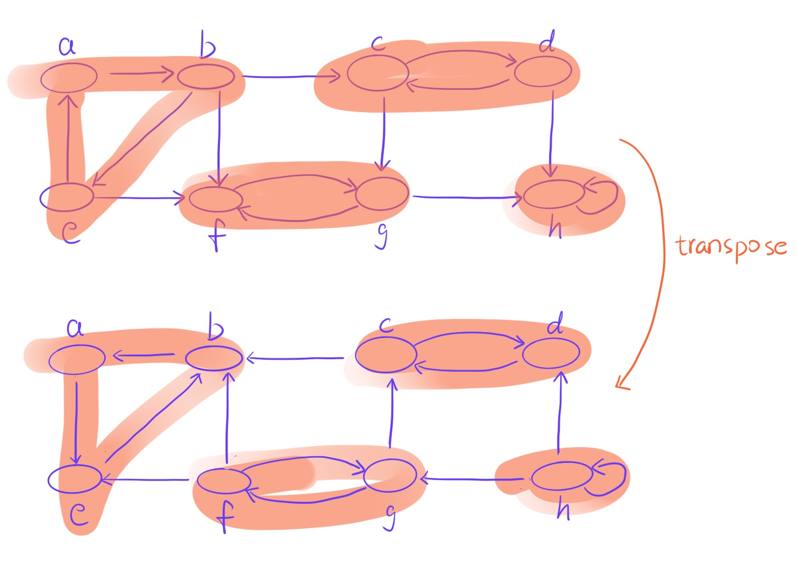

<!-- @import "[TOC]" {cmd="toc" depthFrom=1 depthTo=6 orderedList=false} -->

<!-- code_chunk_output -->

- [Graph](#graph)
  - [BFS](#bfs)
  - [DFS](#dfs)
    - [depth-first forest](#depth-first-forest)
  - [TopologicalSort](#topologicalsort)
  - [StrongConnectedComponents](#strongconnectedcomponents)

<!-- /code_chunk_output -->

# Graph

Use golang to implement some interesting graph algorithms

## BFS



```golang
func TestBFS(t *testing.T) {
  graphAdj := NewGraphAdj[string, int]()

  e1 := Edge[string, int]{
    u:         "r",
    v:         "v",
    w:         0,
    notDirect: true,
  }
  graphAdj.AddEdge(&e1)

  e2 := Edge[string, int]{
    u:         "r",
    v:         "s",
    w:         0,
    notDirect: true,
  }
  graphAdj.AddEdge(&e2)
  ...
  visitFunc := func(u string) bool {
    fmt.Println("BFS-TEST: ", u)
    return true
  }

  ans := graphAdj.Bfs("s", visitFunc)
}
```

```shell
BFS-TEST:  s
BFS-TEST:  r
BFS-TEST:  w
BFS-TEST:  v
BFS-TEST:  t
BFS-TEST:  x
BFS-TEST:  u
BFS-TEST:  y
[s r w v t x u y]
```

## DFS

Dfs not only returns the results of traversal, but also includes two important features, discovery time and completion time. We can use these two time points to draw the depth-first forest of this dfs



```go
func TestDFS(t *testing.T) {
  graphAdj := NewGraphAdj[string, int]()

  e3 := Edge[string, int]{
    u:         "x",
    v:         "v",
    w:         0,
    notDirect: false,
  }
  graphAdj.AddEdge(&e3)
  ... ...
  ans := graphAdj.Dfs(nil)

  fmt.Println(ans)

  dfsForest := graphAdj.DepthFirstForest()
  fmt.Println(dfsForest)
}
```

```shell
[{v 3 4} {x 2 5} {y 1 6} {u 7 8} {z 10 11} {w 9 12}]

[[{x 1 6} {v 2 5} {y 3 4}] [{u 7 8}] [{w 9 12} {z 10 11}]]
```

### depth-first forest


## TopologicalSort

only DAG can call method TopologicalSort



```go
func TestTopologicalSort(t *testing.T) {
  graphAdj := NewGraphAdj[string, int]()

  e3 := Edge[string, int]{
    u:         "shirt",
    v:         "tie",
    w:         0,
    notDirect: false,
  }
  graphAdj.AddEdge(&e3)
  ... ...

  graphAdj.AddVertex("watch")

  fmt.Println(graphAdj)

  ret := graphAdj.TopologicalSort()

  fmt.Println(ret)
}
```

```shell
[{panties 15 18} {pants 16 17} {shirt 7 14} {belt 12 13} {tie 8 11} {jacket 9 10} {watch 5 6} {socks 1 4} {shoe 2 3}]
```



## StrongConnectedComponents



```go
func TestStrongConnectedComponents(t *testing.T) {
  graphAdj := NewGraphAdj[string, int]()

  e3 := Edge[string, int]{
    u:         "a",
    v:         "b",
    w:         0,
    notDirect: false,
  }
  graphAdj.AddEdge(&e3)
  ... ... 
  ans := graphAdj.StrongConnectedComponents()

  fmt.Println(ans)
}
```

```shell
[[e b a] [c d] [g f] [h]]
```
